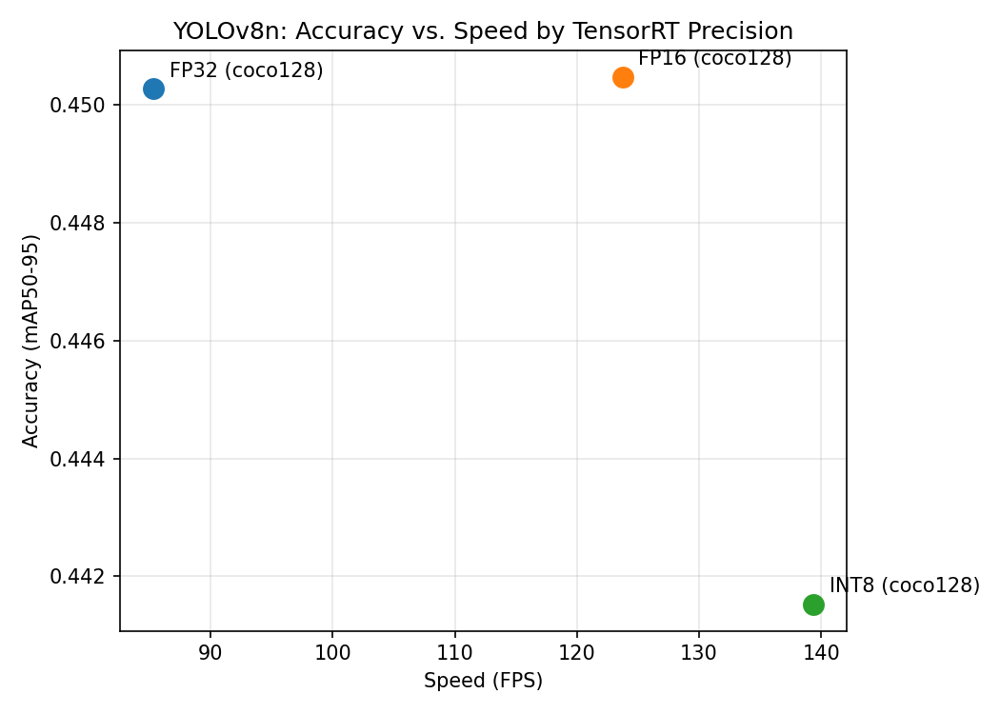
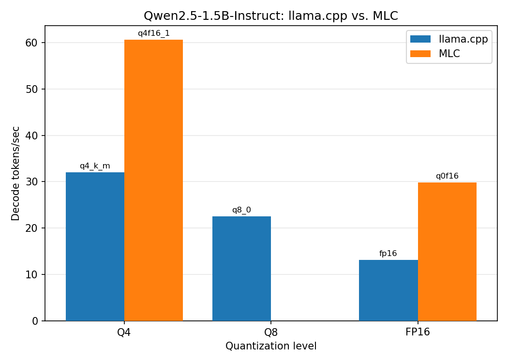
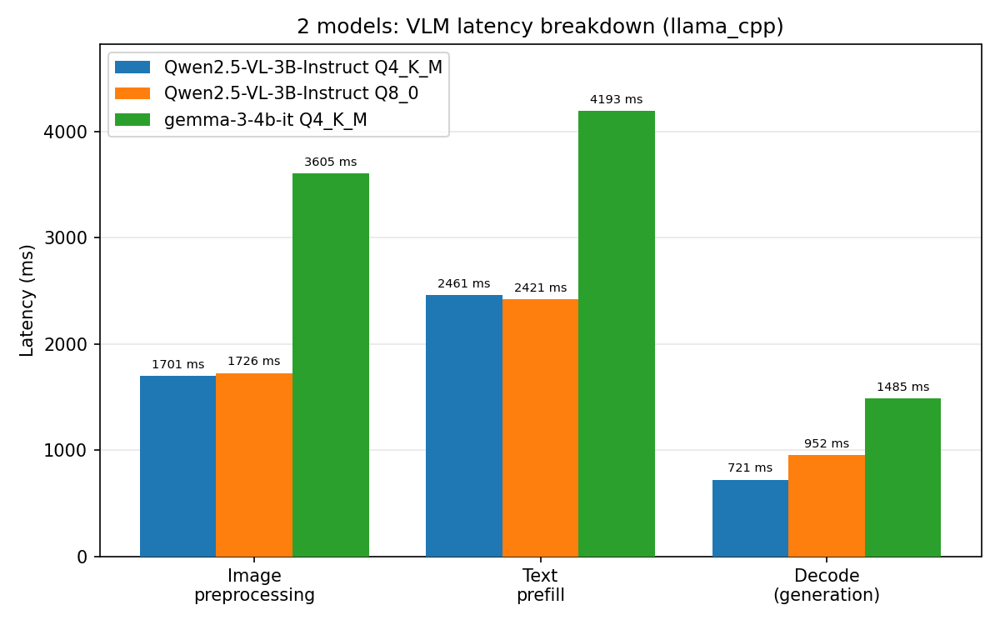

# Jetson Orin Nano: Perception / LLM / VLM Optimization & Benchmarking

A reproducible benchmark suite for vision, LLM, and VLM inference on a Jetson
Orin Nano Super (8GB) across model precisions, quantization levels, and
frameworks, plus a combined perception-to-language pipeline. Power mode
and concurrency are not yet covered — see
[Potential next steps](#potential-next-steps).

Hardware and one-time environment setup (flashing, power modes, Docker/SSD
configuration, the NVIDIA container runtime) are documented in
[SETUP.md](SETUP.md).

## Status

| Phase | Goal | Status |
|---|---|---|
| Vision (YOLOv8n, TensorRT) | Accuracy vs. speed across FP32/FP16/INT8 | ✅ Done |
| LLM (llama.cpp vs. MLC) | Framework/quantization comparison | ✅ Done |
| VLM (Gemma-3-4B, Qwen2.5-VL-3B) | Image+text latency & memory | ✅ Done |
| Combined pipeline | Camera → detection → language | ✅ Done |
| Systematic sweep | Power mode × concurrency × quantization | Not started — see [Potential next steps](#potential-next-steps) |

## Vision benchmarks

YOLOv8n exported to TensorRT at three precisions, benchmarked on-device
(FPS, latency percentiles, mAP against `coco128.yaml`):



| Precision | FPS | Latency (mean) | mAP50-95 |
|---|---|---|---|
| FP32 | ~85 | ~11.7 ms | 0.4503 |
| FP16 | ~124 | ~8.1 ms | 0.4505 |
| INT8 | ~139 | ~7.2 ms | 0.4415 |

FP16 delivers ~45% more throughput than FP32 with no measurable accuracy
loss (mAP50-95 0.4505 vs. 0.4503) — the default precision for this
model/board pair. INT8 adds another ~12% throughput for a ~2% mAP drop.

Reproduce with:
```bash
cd vision-benchmarks
DATA=coco128.yaml bash run_all.sh
python3 plot_results.py
```
[vision-benchmarks/run_all.sh](vision-benchmarks/run_all.sh) runs export
→ TensorRT engine build → benchmark per precision, inside the
`ultralytics/ultralytics:latest-jetson-jetpack6` container.

## LLM benchmarks

Qwen2.5-1.5B-Instruct deployed via llama.cpp and MLC at matched Q4 / Q8
/ FP16 quantization levels where supported, measuring decode tokens/sec,
time-to-first-token, and peak memory/power.



| Framework | Quant | tokens/sec (decode) |
|---|---|---|
| llama.cpp | Q4_K_M | 32.0 |
| llama.cpp | Q8_0 | 22.5 |
| llama.cpp | FP16 | 13.1 |
| MLC | q4f16_1 | 60.6 |
| MLC | q0f16 (FP16) | 29.7 |

MLC is ~2x faster than llama.cpp at every matched quantization level
(AOT-compiled TVM kernels vs. llama.cpp's general-purpose GGUF kernels).
Tradeoff: MLC requires a model- and GPU-specific compile step, and its
version compatibility can lag behind or drop support for older JetPack
releases; llama.cpp runs any GGUF file directly with no compile step and
picks up new model releases immediately via community conversions.

**TensorRT-Edge-LLM is excluded from the baseline.**
jetson-containers' `tensorrt_edgellm` package has no prebuilt image and
builds a ~30-package dependency chain from source; the build fails
repeatedly on out-of-memory errors caused by build tools defaulting to
parallelism levels this board's 8GB can't support (worked around:
constrained build concurrency/memory, capped a compiler's job count,
disabled an unused GPU-architecture target). Independent of the build
issues, TensorRT-LLM's engine-build workflow is memory-intensive by
design and cannot fall back to swap (per NVIDIA's TensorRT-LLM
engineers) — not a practical fit for an 8GB board. Available as a
separate script (`run_tensorrt_edgellm.sh`), not part of the baseline.

Reproduce with:
```bash
sudo nvpmodel -m 2 && sudo jetson_clocks   # MAXN_SUPER, re-apply after reboot
bash llm-benchmarks/run_all.sh             # llama.cpp + MLC, Q4/Q8/FP16 sweep
python3 llm-benchmarks/plot_results.py

# optional, not part of the baseline above:
bash llm-benchmarks/run_tensorrt_edgellm.sh
```

## VLM benchmarks

Gemma-3-4B and Qwen2.5-VL-3B deployed via llama.cpp's multimodal
(`mtmd`) support, reusing the LLM benchmark container. Measures image
preprocessing, text prefill, and decode latency separately, plus peak
memory/power.

Gemma-3-4B is validated on Orin Nano 8GB via llama.cpp in
jetson-ai-lab.com's tutorials. Qwen2.5-VL-3B, a smaller model, is
included for comparison.



| Model | Quant | Preprocessing | Prefill | Decode | Peak memory |
|---|---|---|---|---|---|
| Gemma-3-4B | Q4_K_M | 3605 ms | 4193 ms | 1485 ms | 7153 MB |
| Qwen2.5-VL-3B | Q4_K_M | 1701 ms | 2461 ms | 721 ms | 5060 MB |
| Qwen2.5-VL-3B | Q8_0 | 1726 ms | 2421 ms | 952 ms | 6156 MB |

Qwen2.5-VL-3B is faster than Gemma-3-4B at every stage. Quantization has
negligible effect on preprocessing/prefill (compute-bound) but
measurably affects decode (memory-bandwidth-bound). Only Q4
quantization is stable for a 4B-class model on this board — Gemma's
Q8_0/FP16 crash (SIGSEGV) rather than fail cleanly, a documented
llama.cpp behavior under VRAM pressure, not specific to this setup.
Qwen's smaller footprint has headroom at both Q4 and Q8, indicating the
ceiling tracks model size rather than a fixed per-board quantization
limit.

Reproduce with:
```bash
sudo nvpmodel -m 2 && sudo jetson_clocks   # MAXN_SUPER, re-apply after reboot
bash vlm-benchmarks/run_all.sh
python3 vlm-benchmarks/plot_results.py
```

## Combined pipeline

Camera → YOLOv8n (TensorRT) detection → crop → Gemma-3-4B (llama.cpp)
description. Implemented as two cooperating scripts: vision inference
and the VLM's multimodal support run in separate containers (no single
image covers both), handing off through a shared cache directory rather
than a live API.

Measured latency, one detect-and-describe cycle (steady-state, excludes
camera capture and one-time model loading):

| Stage | Time |
|---|---|
| Vision detection (warmed up) | 8 ms |
| VLM image preprocessing | 3731 ms |
| VLM text prefill | 4350 ms |
| VLM decode (128 tokens) | 8148 ms |
| **Total (`compute_only_ms`)** | **~16.2 s** |
| **Time-to-first-token** (vision + preprocessing + prefill) | **~8.1 s** |

Generation is not observed via streaming (the script waits for the full
response either way), but time-to-first-token is still an exact number,
not an estimate: for an autoregressive model the first generated token
is available as soon as prefill's last step completes, so
preprocessing + prefill *is* TTFT. At ~8.1s it's about half of the total
16.2s — the more relevant number for perceived responsiveness in a UI
that streams text as it arrives rather than waiting for the full
response.

Not a live/frame-rate pipeline. Vision detection matches the Phase 1
benchmark (8ms); the ~16s cost is entirely on the VLM side, split
roughly evenly across preprocessing, prefill, and decode with no single
stage dominant. Consistent with published figures for this model class
on this board (jetson-ai-lab.com's Live VLM WebUI: ~7-8 sec/frame) and
with edge-AI deployment practice generally, where continuous per-frame
VLM inference is not the standard architecture: a fast detector runs
continuously and the VLM is invoked on a trigger (new/changed detection,
user query) rather than every frame. `run_pipeline.sh` implements this
pattern — the VLM stage only fires when the detected class changes
between loop iterations.

Reproduce with:
```bash
# one-time: export the fp16 engine if not already built (see
# combined-pipeline/run_pipeline.sh's header comment for the lightweight
# export.py-only command, vs. the full vision-benchmarks/run_all.sh suite)
sudo nvpmodel -m 2 && sudo jetson_clocks

# single detect-and-describe cycle:
bash combined-pipeline/run_pipeline.sh

# continuous demo loop, VLM firing only when the detected object changes:
LOOP_COUNT=20 LOOP_INTERVAL=3 N_PREDICT=30 bash combined-pipeline/run_pipeline.sh
```

## Potential next steps

Ordered roughly by effort:

1. **Power mode sweep** (15W / 25W / MAXN_SUPER) across the existing
   LLM/VLM benchmarks. Mechanically straightforward — `run_all.sh`
   already captures `avg_power_w` via `tegrastats_summary.py` for every
   run; this only needs an outer loop switching `nvpmodel` before each
   sweep. Keeping it separate from the benchmarks above isolates
   framework/quantization as the only variable in each comparison.
2. **Concurrency sweep**, effort varies by framework. MLC's `MLCEngine`
   is async and already runs in-process; `llm-benchmarks/benchmark_mlc.py`
   currently hardcodes `EngineConfig(max_num_sequence=1)`, so raising
   that and firing concurrent requests at the same engine is moderate
   effort. `benchmark_llama_cpp.py` uses the synchronous
   `llama_cpp.Llama` binding, which has no concurrent-request path —
   testing it means switching to `llama-server` and building a
   load-generation client, a new piece of infrastructure rather than a
   script change. The VLM memory numbers above already suggest the
   answer for that case: Gemma-3-4B's Q4 run peaks at 7.15GB of 7.4GB
   total, so its concurrency ceiling is likely N=1; the smaller LLM
   (1.5B, 3.2-5.8GB peak) has real headroom to test a meaningful curve.
3. **Second VLM framework** (MLC via `nano_llm`) — not attempted:
   `nano_llm` pulls in a large, mostly-unrelated dependency chain (Riva
   ASR, Piper TTS, a vector DB) for one narrow feature, the same pattern
   that made `tensorrt_edgellm` costly to build for the LLM benchmarks.
4. **Demo video.** `combined-pipeline/run_pipeline.sh` already supports
   a looping mode (`LOOP_COUNT`/`LOOP_INTERVAL`) suited to recording one;
   not yet captured.

## Repo structure

```
vision-benchmarks/    # YOLOv8n: PyTorch -> ONNX -> TensorRT, FP16/INT8 comparison
llm-benchmarks/       # LLM via llama.cpp, MLC (TensorRT-Edge-LLM optional, see LLM benchmarks below)
vlm-benchmarks/       # VLM latency breakdown via llama.cpp (Gemma-3-4B, Qwen2.5-VL-3B)
combined-pipeline/    # perception -> language demo (camera -> YOLOv8n -> Gemma-3-4B)
results/              # raw JSON benchmark output, one file per run
scripts/              # measurement harness, automation
docs/                 # charts and writeup
```

## Methodology

Every run logs model, precision/quantization, latency percentiles (mean,
p50, p95), throughput, and accuracy to `results/` as JSON — see
[vision-benchmarks/benchmark.py](vision-benchmarks/benchmark.py) for the
vision harness. Tokens-per-joule as an LLM/VLM efficiency metric and the
power/concurrency axes above are the two dimensions this suite doesn't
yet cover — see [Potential next steps](#potential-next-steps).

---

Vision, LLM, VLM, and a combined perception-to-language demo are
implemented and benchmarked end-to-end on this board, each with a
reproduced chart and a stated hardware ceiling rather than an
unqualified number.
